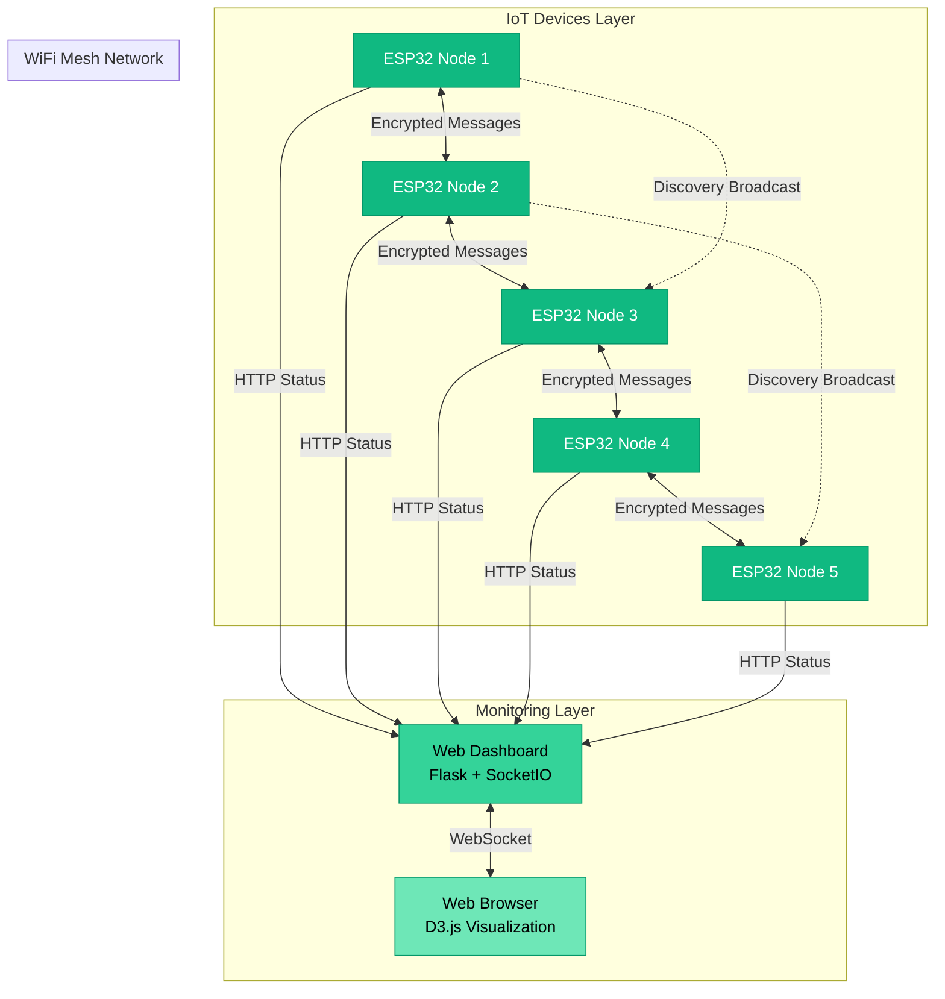
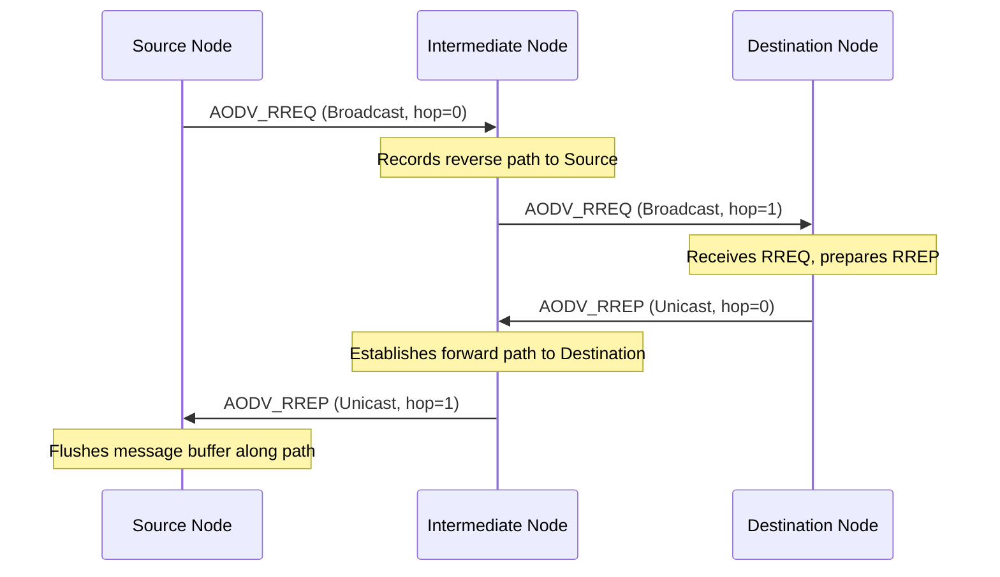
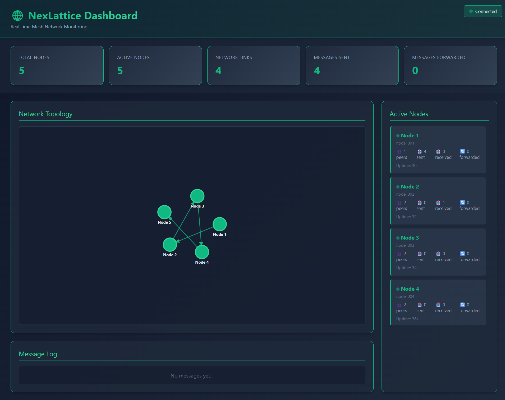

# 🌐 NexLattice

**A Universal, Secure, Low-Latency Wi-Fi Mesh Networking Protocol for IoT Devices**

[](https://www.python.org/downloads/)
[](https://micropython.org/)
[](https://opensource.org/licenses/MIT)

## Overview

NexLattice enables **device-to-device communication** without requiring a central gateway or dedicated firmware. Any microcontroller (ESP32, Raspberry Pi Pico W, etc.) running standard MicroPython can dynamically join the network, exchange encrypted messages, and forward packets through the mesh.

### Key Features

- 🔐 **AES-256-CBC Encryption**: Full end-to-end payload confidentiality with random initialization vector (IV) generation.
- 🔑 **Diffie-Hellman Key Exchange**: Secure, dynamic, forward-secure session key establishment per peer, avoiding static key risks.
- 🗺️ **AODV Dynamic Routing**: Ad-Hoc On-Demand Distance Vector routing using active route requests (RREQ) and route replies (RREP) to form optimal multi-hop paths dynamically.
- ✨ **Zero Configuration**: Plug-and-play auto-discovery via local UDP broadcasts.
- 🛡️ **HMAC-SHA256 Integrity Verification**: Strict message signing and signature validation to protect against packet tampering.
- 📊 **Real-Time Topology Visualization**: Interactive D3.js force-directed topology view in a responsive green/emerald web dashboard.
- 🚀 **Low Latency**: Optimized MicroPython implementation with sub-100ms multi-hop delivery latency.

## Architecture



## Quick Start

### 1. Clone the Repository

```bash
git clone https://github.com/yourusername/NexLattice.git
cd NexLattice
```

### 2. Set Up Dashboard

```bash
# Create virtual environment
python -m venv venv

# Activate it
# Windows:
venv\Scripts\activate
# macOS/Linux:
source venv/bin/activate

# Install dependencies
pip install -r requirements.txt

# Start dashboard
cd dashboard
python app.py
```

Dashboard will be available at: **http://localhost:8080**

### 3. Flash ESP32 Nodes

See detailed instructions in [`docs/setup_instructions.md`](docs/setup_instructions.md)

**Quick version:**

```bash
# Install tools
pip install esptool adafruit-ampy

# Flash MicroPython firmware
esptool.py --port COM3 erase_flash
esptool.py --chip esp32 --port COM3 write_flash -z 0x1000 firmware.bin

# Upload NexLattice code
cd devices
ampy --port COM3 put node_main.py /node_main.py
ampy --port COM3 put network_manager.py /network_manager.py
ampy --port COM3 put crypto_utils.py /crypto_utils.py
ampy --port COM3 put message_router.py /message_router.py
ampy --port COM3 put config.json /config.json

# Repeat for all nodes
```

### 4. Test with Simulator (No Hardware Required!)

```bash
# Run virtual network simulation
python simulator/network_simulator.py
```

The simulator will:
- Create 5 virtual nodes
- Establish mesh connectivity
- Send test messages
- Report to dashboard in real-time

## Project Structure

```
NexLattice/
├── compatibility/             # compatibility testing code
├── devices/                   # ESP32 MicroPython code
│   ├── node_main.py           # Main node logic
│   ├── network_manager.py     # WiFi and communication
│   ├── crypto_utils.py        # Encryption and keys
│   ├── message_router.py      # Routing algorithm
│   └── config.json            # Node configuration
├── dashboard/                 # Web dashboard
│   ├── app.py                 # Flask backend
│   ├── templates/
│   │   └── index.html         # Dashboard UI
│   └── static/
│       └── dashboard.js       # Real-time visualization
├── simulator/                 # Virtual testing
│   └── network_simulator.py   # Software simulation
├── docs/                      # Documentation
│   ├── architecture.md        # System architecture
│   ├── protocol_design.md     # Protocol specification
│   └── setup_instructions.md  # Deployment guide
├── tests/                     # Test plans
│   └── test_plan.md           # Comprehensive testing
├── logo/                      # Project logos
└── requirements.txt           # Python dependencies
```

## How It Works

### 1. Peer Auto-Discovery & Diffie-Hellman Key Exchange

Nodes dynamically discover each other via periodic UDP broadcasts. Upon discovery, they immediately execute a **Diffie-Hellman (DH) key exchange** to establish a secure symmetric session key.

1. **Parameters**: The protocol utilizes Oakley modular arithmetic parameters (128-bit safe prime $P$ and generator $G = 2$).
2. **Key Generation**: Each node generates a random private integer exponent $a$, and derives its public key:
   $$A = G^a \pmod P$$
3. **Exchange**: Public keys are exchanged during the discovery phase.
4. **Secret Derivation**: Nodes compute the shared secret $K = B^a \pmod P$ and run it through a SHA-256 digest to derive a unique, cryptographically strong 32-byte symmetric key for subsequent AES-256-CBC data encryption.

```json
// Discovery Broadcast with DH Public Key
{
  "type": "DISCOVERY",
  "node_id": "node_001",
  "node_name": "Living Room Sensor",
  "public_key": "246738920197463729...",
  "timestamp": 1782947201.123
}
```

---

### 2. AODV Dynamic Route Discovery

When a node needs to transmit a message to a non-neighbor, it initiates an **Ad-Hoc On-Demand Distance Vector (AODV) routing discovery**:



1. **Route Request (RREQ)**: The source buffers the outgoing data and broadcasts an `AODV_RREQ` packet. As intermediate nodes receive the RREQ, they record a reverse routing path pointing back to the source.
2. **Route Reply (RREP)**: Once the RREQ reaches the target destination (or a node with a fresh active route), that node unicasts an `AODV_RREP` packet back along the reverse path. Intermediate nodes establish a forward route to the destination.
3. **Flushing Buffers**: Once the source receives the RREP, it immediately flushes its buffer and transmits the waiting data packets.

```json
// AODV Route Request (RREQ)
{
  "type": "AODV_RREQ",
  "rreq_id": 42,
  "source": "node_001",
  "destination": "node_005",
  "hop_count": 0,
  "timestamp": 1782947203.456,
  "signature": "8a3e9c..."
}
```

---

### 3. AES-256-CBC Encrypted & Signed Communication

Once the DH key is derived and the AODV route is established, data is transmitted end-to-end securely.

*   **Confidentiality**: Payloads are encrypted using **AES-256-CBC** with a dynamically generated random Initialization Vector (IV).
*   **Integrity & Authenticity**: All control and data frames are signed with an **HMAC-SHA256 signature** using the network-wide pre-shared key (PSK) and constant-time string comparison, protecting the network from replay and packet injection attacks.

```json
// Signed and Encrypted DATA Message
{
  "type": "DATA",
  "source": "node_001",
  "destination": "node_005",
  "payload": "f0a3e918d2bb...", // AES-256-CBC Encrypted Payload
  "encrypted": true,
  "hop_count": 2,
  "timestamp": 1782947205.789,
  "signature": "d34e9a8fcf2093e8..." // HMAC-SHA256 Message Signature
}
```

## Dashboard Features & SS

- **Live Network Topology**: Interactive D3.js graph showing nodes and connections
- **Node Status**: Real-time health monitoring with latency measurements
- **Message Log**: Live feed of all messages flowing through the network
- **Statistics**: Total nodes, links, messages sent/received/forwarded
- **Beautiful UI**: Modern design with emerald/green color scheme

## Configuration

Edit `devices/config.json` for each node:

```json
{
  "node_id": "node_001",
  "node_name": "Kitchen Hub",
  "wifi_ssid": "YourNetwork",
  "wifi_password": "YourPassword",
  "dashboard_ip": "192.168.1.100",
  "dashboard_port": 8080,
  "discovery_port": 5000,
  "message_port": 5001,
  "encryption_enabled": true,
  "max_peers": 10,
  "discovery_interval": 30,
  "health_check_interval": 10
}
```

## Testing

### Unit Tests

```bash
pytest tests/unit/
```

### Integration Tests

```bash
pytest tests/integration/
```

### Network Simulation

```bash
python simulator/network_simulator.py
```

### Full Test Plan

See [`tests/test_plan.md`](tests/test_plan.md) for comprehensive testing procedures.

## Performance

| Metric | Target | Typical |
|--------|--------|---------|
| Discovery Time | < 30s | ~20s |
| Message Latency | < 100ms | ~50ms |
| Delivery Success Rate | > 99% | 99.5% |
| Max Hops | 5 | 3-4 |
| Throughput | 50+ msg/s | 75 msg/s |
| Memory Usage (ESP32) | < 100KB | ~40KB |
| Supported Nodes | 20+ | Tested with 10 |

## Documentation

- **[Architecture](docs/architecture.md)**: System design and components
- **[Architecture Diagrams](docs/ARCHITECTURE_DIAGRAM.md)**: Visual Mermaid diagrams (12 detailed diagrams)
- **[Protocol Design](docs/protocol_design.md)**: Message formats and protocol specification
- **[Setup Instructions](docs/setup_instructions.md)**: Complete deployment guide
- **[Test Plan](tests/test_plan.md)**: Testing procedures and scenarios

## Use Cases

### Home Automation
- Sensor networks without central hub
- Room-to-room communication
- Resilient to gateway failures

### Industrial IoT
- Factory floor monitoring
- Equipment-to-equipment coordination
- Redundant communication paths

### Agricultural Monitoring
- Field sensor networks
- Long-range multi-hop connectivity
- Low-power operation

### Smart Cities
- Street light networks
- Environmental monitoring
- Distributed data collection

## Roadmap

- [x] Basic mesh networking
- [x] Encryption and security
- [x] Multi-hop routing
- [x] Dashboard monitoring
- [x] Virtual simulator
- [ ] Adaptive routing with link quality
- [ ] QoS and priority messaging
- [ ] OTA firmware updates
- [ ] Mobile app for monitoring
- [ ] Integration with cloud services
- [ ] Support for more platforms (Pico W, Arduino, etc.)

## Contributing

Contributions welcome! Please:

1. Fork the repository
2. Create a feature branch
3. Make your changes
4. Add tests
5. Submit a pull request

## License

This project is licensed under the MIT License - see [LICENSE](LICENSE) file for details.

## Acknowledgments

- **MicroPython Team**: For the excellent ESP32 port
- **Flask-SocketIO**: For real-time dashboard communication
- **D3.js**: For beautiful network visualization
- **Community**: For feedback and contributions

## Support

- **Issues**: [GitHub Issues](https://github.com/yourusername/NexLattice/issues)
- **Discussions**: [GitHub Discussions](https://github.com/yourusername/NexLattice/discussions)
- **Email**: your.email@example.com

## Citation

If you use NexLattice in your research, please cite:

```bibtex
@software{nexlattice2025,
  title = {NexLattice: A Universal Mesh Networking Protocol for IoT},
  author = {Your Name},
  year = {2025},
  url = {https://github.com/yourusername/NexLattice}
}
```

---

**Made with ❤️ for the IoT community**

🌟 **Star us on GitHub if you find this useful!** 🌟

