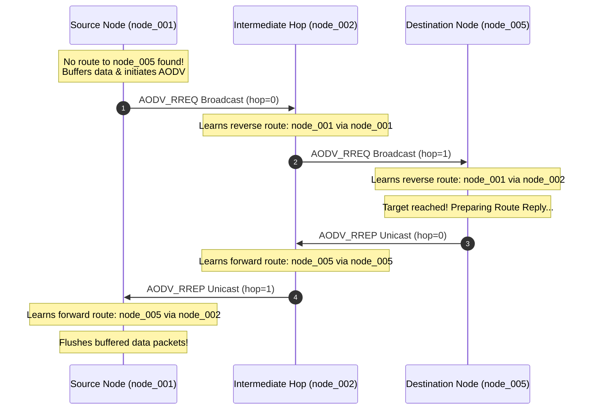

# 🌐 NexLattice v2 - Protocol Specification & Changes

This document details the advanced cryptographic and routing upgrades introduced in **NexLattice v2**. These enhancements transition the protocol from a simple static forwarding mesh to an industry-grade, security-first, dynamic **P2P Ad-Hoc mesh network**.

---

## 🚀 Key Upgrades in v2

NexLattice v2 introduces three foundational advancements to the mesh stack:
1.  **Diffie-Hellman (DH) Key Exchange:** Establishes dynamic, peer-specific, and forward-secure AES session keys.
2.  **Ad-Hoc On-Demand Distance Vector (AODV) Routing:** Dynamically builds multi-hop paths on-demand, eliminating static tables and loop states.
3.  **AES-256-CBC Encryption & HMAC-SHA256 Signing:** Enforces strict confidentiality, authenticity, and packet integrity across all control and data frames.

---

## 🔑 1. Diffie-Hellman (DH) Key Exchange

To prevent eavesdropping and eliminate the security risk of using static network-wide encryption keys, NexLattice v2 implements a dynamic key exchange during the peer auto-discovery phase.

### 📐 Mathematical Model & Parameters
The protocol utilizes Oakley Group modular exponentiation parameters optimized for resource-constrained MicroPython environments:
*   **128-bit Safe Prime ($P$):** `340282366920938463463374607431768211297`
*   **Generator ($G$):** `2`

### 🔁 Sequence of Key Exchange
1.  **Private Key Generation:** Each node dynamically generates a private 128-bit integer exponent $a$:
    $$a \in [2, P-2]$$
2.  **Public Key Derivation:** Each node derives its public key $A$:
    $$A = G^a \pmod P$$
3.  **Public Key Exchange:** Nodes exchange their public keys during discovery broadcasts.
4.  **Shared Secret Derivation:** Upon receipt of a peer's public key $B$, the node computes the shared secret $K$:
    $$K = B^a \pmod P$$
5.  **AES Key Extraction:** The shared secret $K$ is hashed using a single round of SHA-256 to extract a cryptographically robust 32-byte symmetric key used for all future **AES-256-CBC** frame encryption between these two peers:
    $$\text{Session Key} = \text{SHA-256}(K)$$

```json
// Discovery Broadcast including DH Public Key
{
  "type": "DISCOVERY",
  "node_id": "node_001",
  "node_name": "Living Room Sensor",
  "public_key": "24673892019746372983719284729381", // DH Public Key
  "timestamp": 1782947201.123
}
```

---

## 🗺️ 2. AODV Dynamic Routing Protocol

Static routing tables are inefficient and prone to loop states in mobile or dynamic IoT networks. NexLattice v2 implements a custom **Ad-Hoc On-Demand Distance Vector (AODV)** routing protocol to establish optimal paths dynamically.



### 🔁 Routing Sequence Flow
1.  **On-Demand Buffering:** When a node wants to send a `DATA` packet to a destination for which it lacks a routing path, it intercepts and buffers the packet in `self.message_buffer` instead of flooding.
2.  **Route Request (RREQ) Flooding:** The source broadcasts an `AODV_RREQ` containing a unique `rreq_id`.
3.  **Reverse Path Setup:** As intermediate nodes receive the RREQ, they cache the `(source, rreq_id)` to prevent loop replication. They record a reverse route entry to the source pointing to the sender's IP.
4.  **Route Reply (RREP) Unicast:** When the RREQ reaches the target destination (or an intermediate node with an active route), it generates an `AODV_RREP` and unicasts it back along the reverse path.
5.  **Forward Path Setup:** Intermediate nodes receiving the RREP establish a forward routing table entry to the destination, and propagate the RREP back to the source.
6.  **Buffer Flushing:** Once the source receives the RREP, it flushes its buffer and immediately transmits all waiting data packets along the newly established route.

```json
// AODV Route Request (RREQ)
{
  "type": "AODV_RREQ",
  "rreq_id": 42,
  "source": "node_001",
  "destination": "node_005",
  "hop_count": 0,
  "timestamp": 1782947203.456,
  "signature": "a8d3fe..."
}
```

---

## 🛡️ 3. AES-256-CBC & HMAC-SHA256 Security Model

All protocol communications inside NexLattice v2 are protected against eavesdropping, packet tampering, and replay attacks.

*   **Confidentiality (AES-256-CBC):** Data packet payloads are encrypted using **AES-256-CBC** using the unique symmetric session keys generated via Diffie-Hellman. A random 16-byte Initialization Vector (IV) is prefixed to each ciphertext block to ensure semantic security.
*   **Integrity & Authenticity (HMAC-SHA256):** To prevent malicious packet injection, **all control and data frames must be signed**. 
    *   Signatures are calculated using an **HMAC-SHA256** digest over the entire JSON string utilizing the shared network-wide `pre_shared_key` (PSK).
    *   Any incoming frame without a signature, or with an invalid signature, is immediately rejected and logged.
    *   Constant-time string comparisons (`_constant_time_compare`) are enforced globally to prevent timing attacks.

```json
// Encrypted and Signed DATA Message
{
  "type": "DATA",
  "source": "node_001",
  "destination": "node_005",
  "payload": "ab12fd89e02c...", // AES ciphertext block
  "encrypted": true,
  "hop_count": 2,
  "timestamp": 1782947205.789,
  "signature": "d34e9a8fcf2093e8e78a2bc45..." // HMAC-SHA256 signature
}
```

---

## 📁 Source Modifications

The following files contain the implemented v2 logic:
1.  [`devices/crypto_utils.py`](file:///f:/Projects/github/NexLattice/devices/crypto_utils.py): Oakley Group 128-bit parameters, modular power computations, SHA-256 key derivation, symmetric signing/verification, and constant-time checks.
2.  [`devices/message_router.py`](file:///f:/Projects/github/NexLattice/devices/message_router.py): Dynamic routing table, message wait buffers, sequence check tables, seen-RREQ caches, AODV RREQ broadcasts, and unicast RREP forwarding/flushing.
3.  [`devices/node_main.py`](file:///f:/Projects/github/NexLattice/devices/node_main.py): AODV frame parsing, signature checks, and router handlers.
4.  [`simulator/network_simulator.py`](file:///f:/Projects/github/NexLattice/simulator/network_simulator.py): Simulated DH key exchange console outputs and dynamic BFS path-finding simulating dynamic AODV RREQ flooding, reverse routes, RREP unicasts, and automatic healing on node failure/recovery.
