# NexLattice Architecture - Mermaid Diagrams

## 1. Overall System Architecture

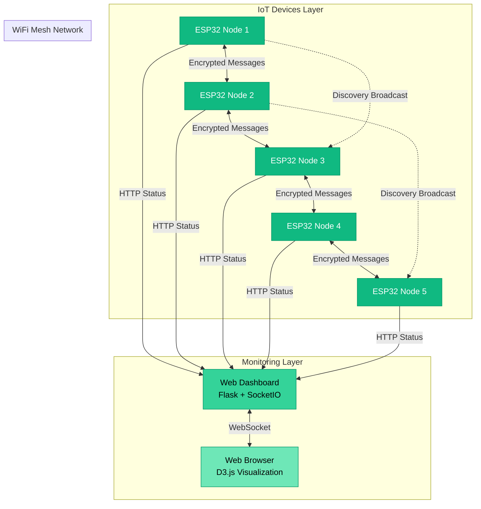

## 2. Node Internal Architecture

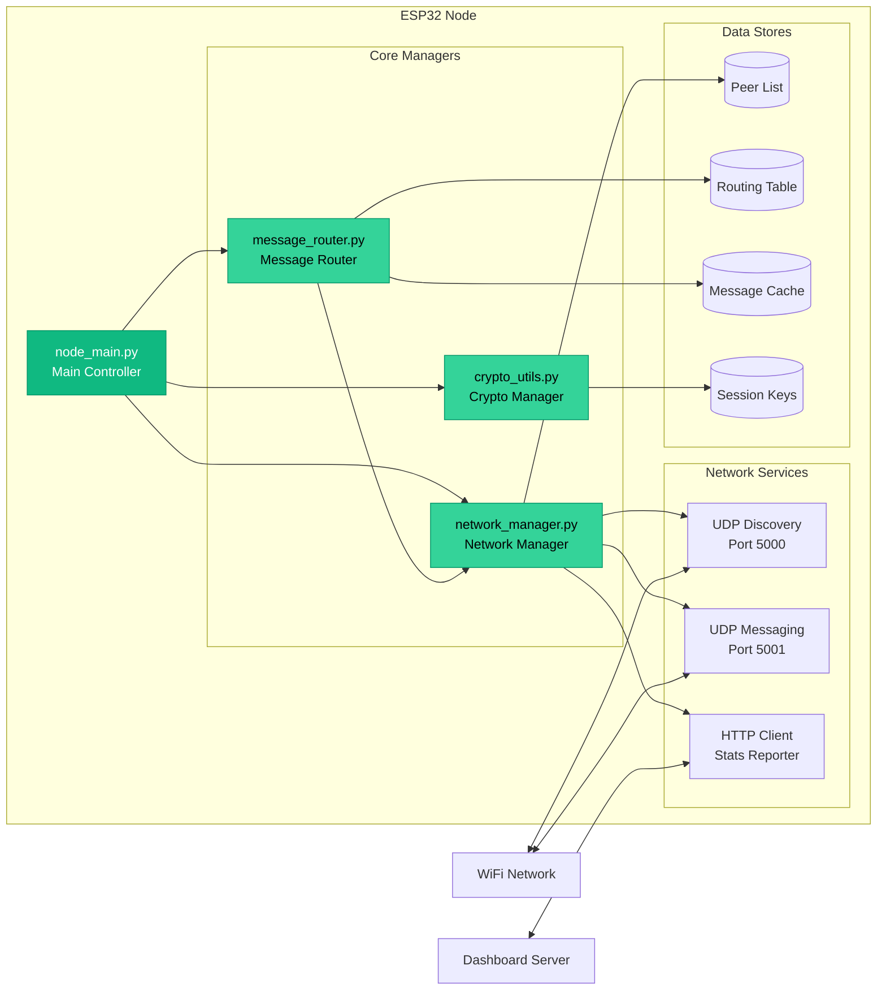

## 3. Message Flow - Discovery Process

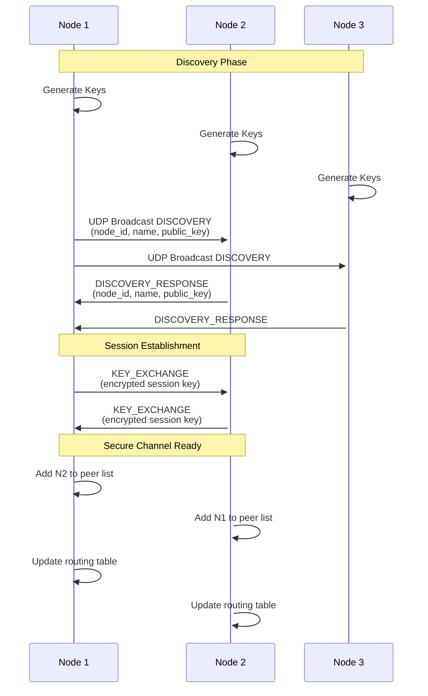

## 4. Message Flow - Multi-Hop Routing

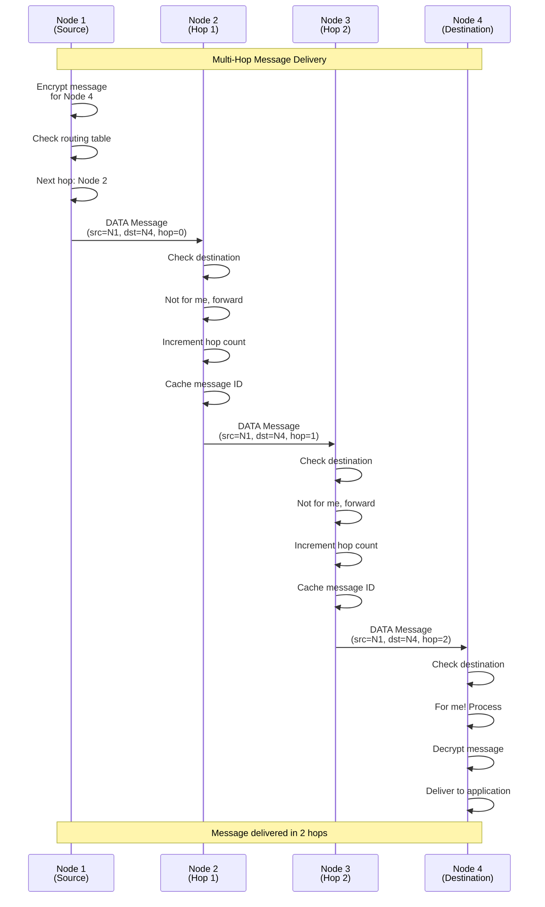

## 5. Protocol Stack

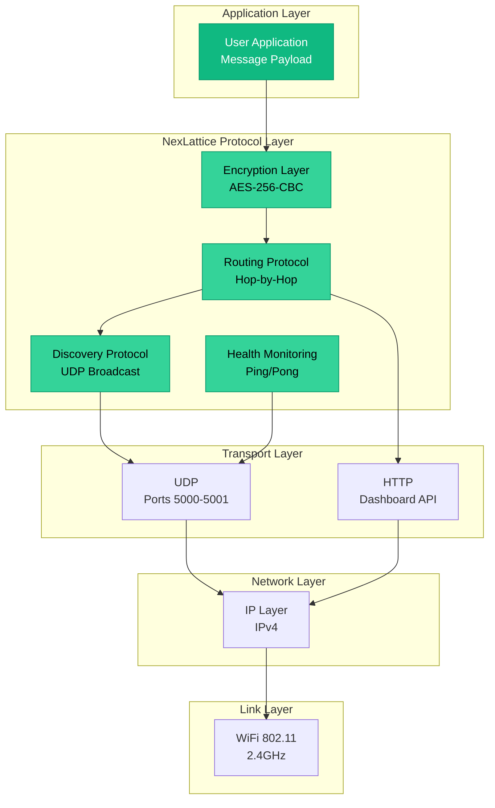

## 6. Dashboard Architecture

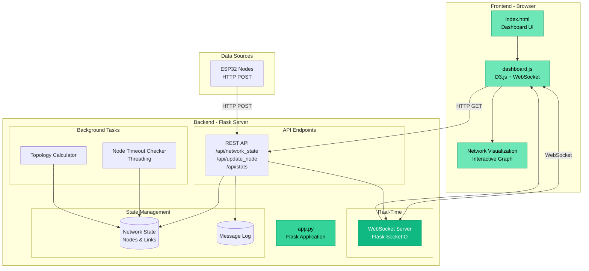

## 7. Security Architecture

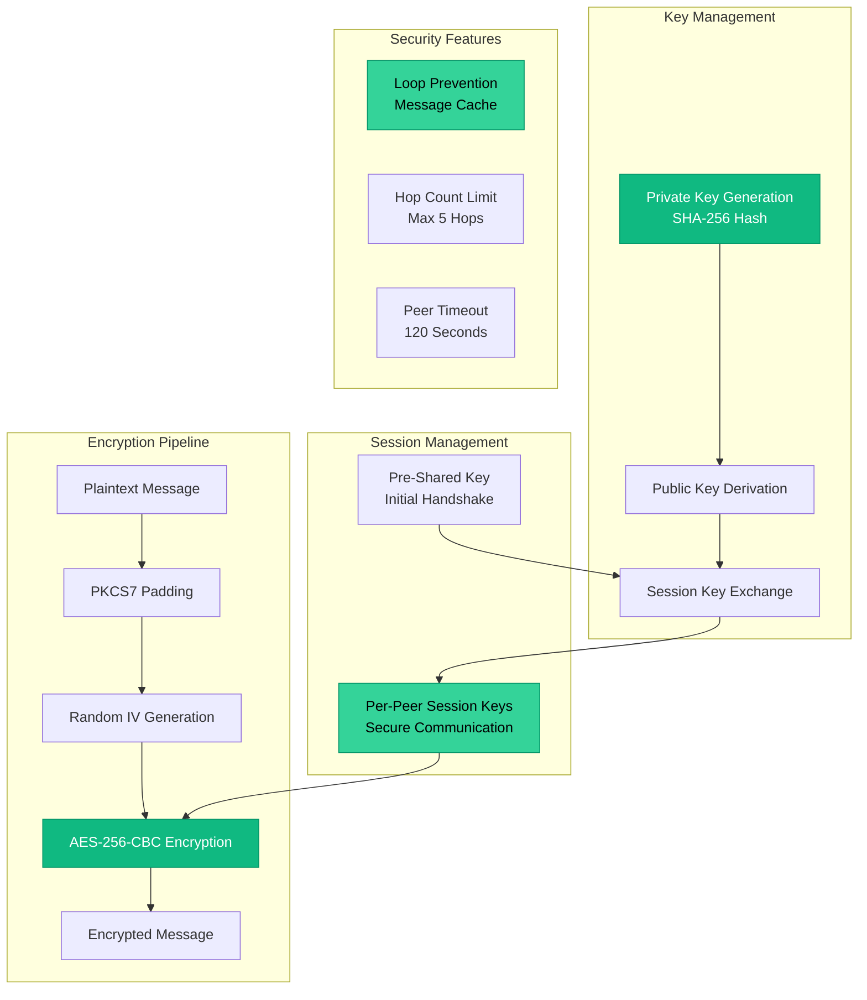

## 8. Data Flow - Complete Message Journey

```mermaid
graph LR
    subgraph "Node 1 - Source"
        App1[Application]
        Enc1[Encrypt]
        Route1[Router]
        Net1[Network]
    end
    
    subgraph "Node 2 - Hop"
        Net2[Network]
        Route2[Router]
        Cache2[Check Cache]
        Forward2[Forward]
    end
    
    subgraph "Node 3 - Destination"
        Net3[Network]
        Route3[Router]
        Dec3[Decrypt]
        App3[Application]
    end
    
    App1 -->|Plaintext| Enc1
    Enc1 -->|Ciphertext| Route1
    Route1 -->|Add Headers| Net1
    Net1 -->|UDP| Net2
    
    Net2 --> Route2
    Route2 --> Cache2
    Cache2 -->|Not Duplicate| Forward2
    Forward2 -->|UDP| Net3
    
    Net3 --> Route3
    Route3 -->|Destination Match| Dec3
    Dec3 -->|Plaintext| App3
    
    style App1 fill:#10b981,stroke:#059669,color:#fff
    style Enc1 fill:#34d399,stroke:#059669,color:#000
    style Route1 fill:#34d399,stroke:#059669,color:#000
    style Route2 fill:#34d399,stroke:#059669,color:#000
    style Dec3 fill:#34d399,stroke:#059669,color:#000
    style App3 fill:#10b981,stroke:#059669,color:#fff
```

## 9. Node State Machine

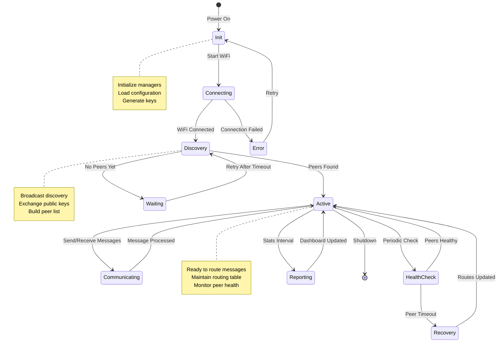

## 10. Routing Algorithm Flow

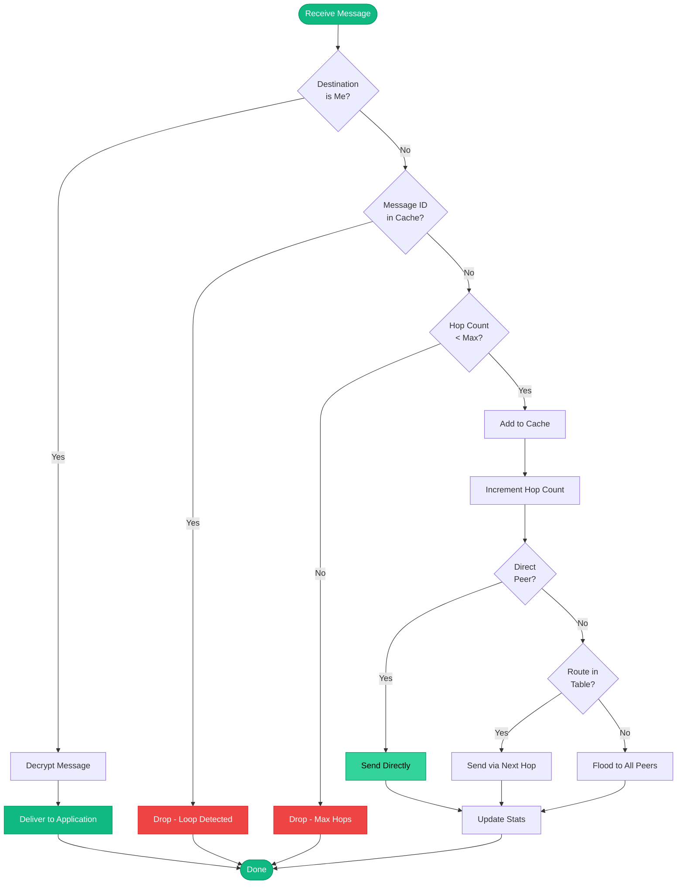

## 11. Dashboard Real-Time Updates

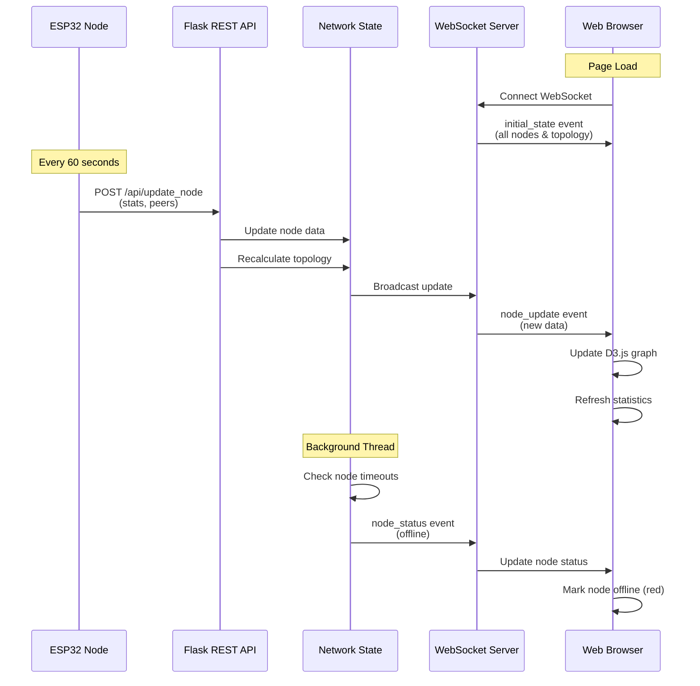

## 12. Deployment Architecture

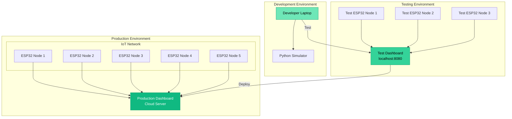

---

## How to View These Diagrams

### In GitHub
These diagrams will render automatically when viewing this file on GitHub.

### In VS Code
Install the "Markdown Preview Mermaid Support" extension.

### Online
Copy any diagram code block and paste it into: https://mermaid.live/

### In Documentation Tools
Most modern documentation tools (GitBook, Docusaurus, MkDocs) support Mermaid natively.

---

**Generated for NexLattice Project**  
*Last Updated: October 2025*

